<picture>
  <source media="(prefers-color-scheme: dark)" srcset="assets/banner-dark.svg">
  
</picture>

### Heyo, I'm Bazil 👋

I build backend systems, data pipelines, and internal tools that teams actually rely on.

Currently focused on AI integrations and API development, with a strong background in platform engineering and event-driven architecture.

**Recent work**
- Live AI voice assistant for automated customer booking (BarberBot)
- Tech lead for a production operations platform at Metrolinx (React · Node.js · MongoDB)
- Built an event-driven integration processing real-time rail data across 20 message queues

**Stack:** TypeScript · Node.js · React · Python · C# · Ruby · Azure · Kubernetes · Terraform

More about me at [heyitsbaz.com](https://www.heyitsbaz.com)
